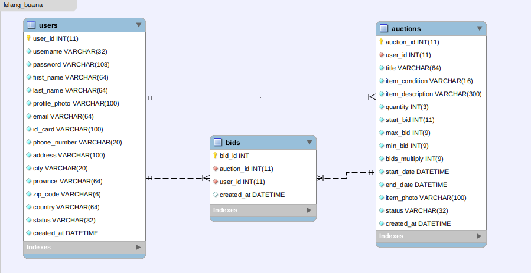

# lelangbuana-backend
Back End repository for Lelangbuana project

## Database Design (Main Tables)

## REST API Endpoints
1. Endpoints of 'users' table

| Endpoint              | HTTP   | Description              |
| ----------------------| ------ | -------------------------|
| `/`                   | GET    | Get root API             |
| `/users`              | GET    | Get all users            |
| `/users/id/:id`       | GET    | Get one user by id       |
| `/users/:username`    | GET    | Get one user by username |
| `/users/search`       | GET    | Search user by username  |
| `/users/checktoken`   | GET    | Logout user              |
| `/users/logout`       | GET    | Logout user              |
| `/users/register`     | POST   | Register user            |
| `/users/login`        | POST   | Login user               |
| `/users/:id`          | PUT    | Update one user by id    |
| `/users/:id`          | DELETE | Delete one user by id    |

2. Endpoints of 'auctions' table

| Endpoint                    | HTTP   | Description                    |
| ----------------------------| ------ | -------------------------------|
| `/auctions`                 | GET    | Get all of auction data        |
| `/auctions/:id`             | GET    | Get auction data by id         |
| `/auctions/search?q=`       | GET    | Search auction data by keyword |
| `/auctions/user_id/:id`     | GET    | Get auction data by user id    |
| `/auctions/status/:status`  | GET    | Get auction data by status     |
| `/auctions/`                | POST   | Insert new auction data        |
| `/auctions/:id`             | PUT    | Update one auction data        |
| `/auctions/:id`             | DELETE | Delete one auction data        |

3. Endpoints of 'bids' table

| Endpoint                | HTTP   | Description                 |
| ------------------------| ------ | ----------------------------|
| `/bids`                 | GET    | Get all of bid data         |
| `/bids/:id`             | GET    | Get bid data by id          |
| `/bids/user_id/:id`     | GET    | Get bid data by user id     |
| `/bids/auction_id/:id`  | GET    | Get bid data by status      |
| `/bids/`                | POST   | Insert new bid data         |
| `/bids/:id`             | PUT    | Update one bid data         |
| `/bids/:id`             | DELETE | Delete one bid data         |